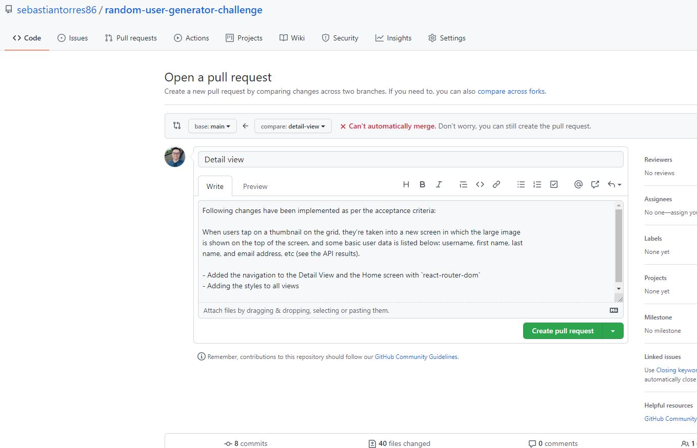

# Random Users API Solution

This is a solution to the challenge to create a simple page using the Random User API.

## Table of contents

- [Overview](#overview)
  - [The challenge](#the-challenge)
  - [Screenshot](#screenshot)
  - [Links](#links)
- [My Process](#-my-process)
  - [How I worked on this project](#how-i-worked-on-this-project)
  - [How to navigate this project](#how-to-navigate-this-project)
  - [Why I built the project this way](#why-i-built-the-project-this-way)
  - [If I had more time I would change this](#if-i-had-more-time-i-would-change-this)
- [Available Scripts](#available-scripts)

## Overview

### The challenge

Users should be able to:

- The app/page should have a Master/Detail flow in which at least 50 profile image thumbnails are
  shown on a grid on a “home” screen. The list must show:

  - Small picture
  - Full name
  - City
  - Country

- When users tap on a thumbnail on the grid, they’re taken into a new screen in which the large image is shown on the top of the screen, and some basic user data is listed below: username, first name, last name, and email address, etc (see the API results)

### Screenshots

### Links

- Live Site URL: [https://random-user-generator-challenge.vercel.app/](https://random-user-generator-challenge.vercel.app/)

## My process

### How I worked on this project

My goal was to simulate a professional work environment.

- I worked with tasks on a Kanban board:

  

- I used feature branches and Pull Requests:

### How to navigate this project

- Somewhat complex stateful logic: [here](src/views/home/Home.js)
- Responsive CSS using styled-components: [here](src/views/home/Home.styles.js)
- The application fetches data from the Random User Generator API: Examples for the request and data transformation: [here](src/views/home/Home.js)

### Why I built the project this way

- I didn't use a state management library like Redux on purpose. For this app simple `useState` is
  sufficient. I realized that more and more projects don't use Redux anymore since GraphQL or
  react-query are often used for data management.
- styled-components is a great library for styling. It includes an auto-prefixer, uses scoped
  classes, and allows a seamless integration with JS.
- My plan is to become a full-stack developer eventually. But for the beginning I focus on the
  frontend. I have basic backend knowledge as well.

### If I had more time I would change this

- Set up continuous integration to run the tests and ESLint on every Pull Request
- Refactor some of the code.
- Testing is an essential part of production applications. Testing Library is the go-to library in the React community. I want to cover the essential features of the app with tests.
- Add end-to-end tests with Cypress.

## Available Scripts

In the project directory, you can run:

### `yarn start`

Runs the app in the development mode.\
Open [http://localhost:3000](http://localhost:3000) to view it in the browser.

The page will reload if you make edits.\
You will also see any lint errors in the console.

### `yarn test`

Launches the test runner in the interactive watch mode.\
See the section about [running tests](https://facebook.github.io/create-react-app/docs/running-tests) for more information.

### `yarn build`

Builds the app for production to the `build` folder.\
It correctly bundles React in production mode and optimizes the build for the best performance.

The build is minified and the filenames include the hashes.\
Your app is ready to be deployed!

See the section about [deployment](https://facebook.github.io/create-react-app/docs/deployment) for more information.

### `yarn eject`

**Note: this is a one-way operation. Once you `eject`, you can’t go back!**

If you aren’t satisfied with the build tool and configuration choices, you can `eject` at any time. This command will remove the single build dependency from your project.

Instead, it will copy all the configuration files and the transitive dependencies (webpack, Babel, ESLint, etc) right into your project so you have full control over them. All of the commands except `eject` will still work, but they will point to the copied scripts so you can tweak them. At this point you’re on your own.

You don’t have to ever use `eject`. The curated feature set is suitable for small and middle deployments, and you shouldn’t feel obligated to use this feature. However we understand that this tool wouldn’t be useful if you couldn’t customize it when you are ready for it.

## Learn More

You can learn more in the [Create React App documentation](https://facebook.github.io/create-react-app/docs/getting-started).

To learn React, check out the [React documentation](https://reactjs.org/).

### Code Splitting

This section has moved here: [https://facebook.github.io/create-react-app/docs/code-splitting](https://facebook.github.io/create-react-app/docs/code-splitting)

### Analyzing the Bundle Size

This section has moved here: [https://facebook.github.io/create-react-app/docs/analyzing-the-bundle-size](https://facebook.github.io/create-react-app/docs/analyzing-the-bundle-size)

### Making a Progressive Web App

This section has moved here: [https://facebook.github.io/create-react-app/docs/making-a-progressive-web-app](https://facebook.github.io/create-react-app/docs/making-a-progressive-web-app)

### Advanced Configuration

This section has moved here: [https://facebook.github.io/create-react-app/docs/advanced-configuration](https://facebook.github.io/create-react-app/docs/advanced-configuration)

### Deployment

This section has moved here: [https://facebook.github.io/create-react-app/docs/deployment](https://facebook.github.io/create-react-app/docs/deployment)

### `yarn build` fails to minify

This section has moved here: [https://facebook.github.io/create-react-app/docs/troubleshooting#npm-run-build-fails-to-minify](https://facebook.github.io/create-react-app/docs/troubleshooting#npm-run-build-fails-to-minify)
